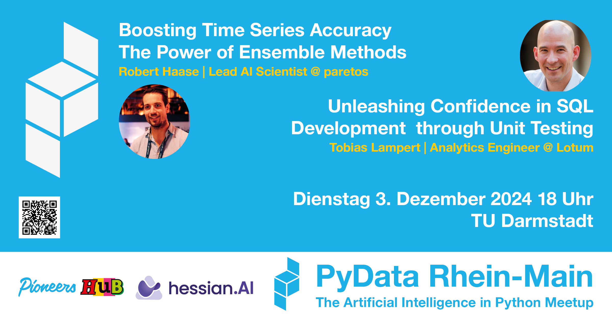
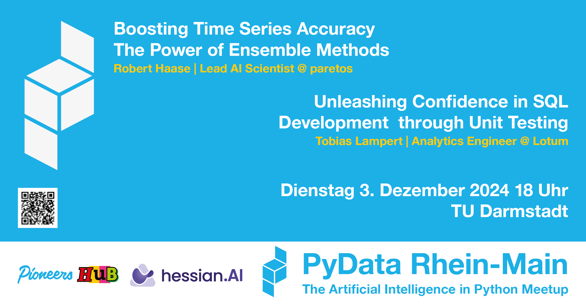

# 2024-12-03

 [link](eventbanner-pydata-rhein-main-241203-QR-pics.png)

## Boosting Time Series Accuracy: The Power of Ensemble Methods
Robert Haase
Lead AI Scientist
Affiliation: paretos
https://www.linkedin.com/in/robert-haase-7188551b0/ 

### Talk
This talk explores the practical application of ensemble methods in time series analysis, based on Robert’s extensive experience at Pareto. It covers various ensembling approaches, highlighting their effectiveness in different real-world scenarios. Attendees will gain insights into which methods perform best in practice, supported by behind-the-scenes examples of successful implementations. The session provides valuable strategies for improving predictive accuracy, making it ideal for anyone looking to leverage ensemble techniques in their time series projects.

### About
Robert earned both his Bachelor's and Master's degrees in Physics from the University of Heidelberg, specializing in Condensed Matter Physics and Computational Physics. During his Master's thesis in 2020, he advanced existing NLP Transformer architectures for timeseries applications. This involved Robert working extensively with uncertainty quantifications and normalizing flows. Since the beginning of 2021, he has been employed at Paretos, where the primary focus of his work lies in Timeseries Forecasting, specifically demand forecasting. Robert has a keen interest in combining traditional statistical methods with deep learning techniques.

## Unleashing Confidence in SQL Development through Unit Testing
Tobias Lampert
Expert Analytics Engineer
Affiliation: Lotum media
https://www.linkedin.com/in/tlampert/ 

### Talk (short)
As data-driven applications grow, robust SQL development practices are crucial. This talk explores the challenges of maintaining complex SQL models in Data Warehouses and highlights the importance of unit testing in ensuring data quality. Attendees will learn how SQL unit testing validates modeling logic, prevents breaking changes, and supports faster deployment cycles. The session features Lotum’s Python-based SQL unit testing framework for BigQuery, which processes millions of daily events from mobile games. Discover how using small, static mock data simplifies testing and helps identify code errors efficiently.

### Talk (long)
As the landscape of data-driven applications expands, the need for robust SQL development practices becomes increasingly critical. This conference talk addresses the challenges faced by data teams in maintaining and evolving complex SQL models for their Data Warehouses, and shows how unit testing can play a vital role in ensuring data quality.
We will delve into the significance of SQL unit testing, highlighting its ability to quickly validate modeling logic and making sure that modifications do not break existing behavior. With the ease of mind of an automatically verified SQL logic, changes to existing data models can be shipped with confidence, ultimately contributing to faster deployment cycles.
Get detailed insights on the structure and functionality of Lotum’s SQL unit testing framework, built in Python using pytest and tailored for BigQuery. With Lotum processing millions of events from mobile games every day, explore how this robust framework allows for efficient testing, ensuring the accuracy of the SQL logic. Learn how test cases with small sets of static mock data can be defined effortlessly so that they help pinpoint potential code errors easily.

### About
Tobias Lampert is an experienced technical leader with expertise in Data Science and Data Engineering. With over 20 years of experience, he has designed and implemented data-intensive applications end-to-end, covering everything from data ingestion to deployment. He has developed solutions that generate insights from data using statistical analysis and machine learning. His passion lies in building user-friendly, high-performance, and cost-efficient data platforms.

## Creatives

 [link](eventbanner-pydata-rhein-main-241203.png)
  [link](eventbanner-pydata-rhein-main-241203-QR.png)

