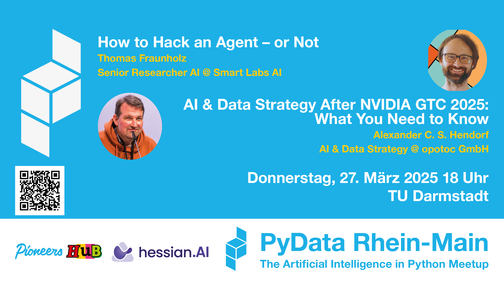
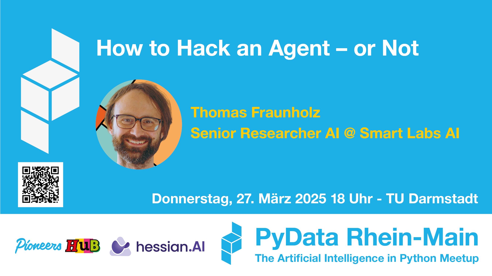
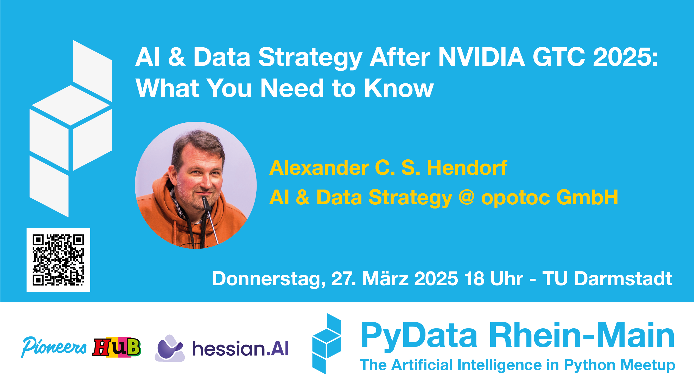

# 2024-12-03

 [link](eventbanner-pydata-rhein-main-250327-MU-pics.png)

Organized by 

Pioneers Hub gGmbH   
[LinkedIn](https://www.linkedin.com/company/pioneershub/)
[Website](https://pioneershub.org)

Hessian AI   
[LinkedIn](https://www.linkedin.com/company/hessian-ai-the-hessian-center-for-artificial-intelligence/)
[Website](https://hessian.ai)

## How to Hack an Agent – or Not
Thomas Fraunholz  
Senior Researcher AI  
Affiliation: Smart Labs AI  
[LinkedIn](https://www.linkedin.com/in/thomas-fraunholz/)

### Talk
Large language models (LLMs) are not as secure as they seem. Beyond their tendency to “hallucinate,” they can be manipulated using jailbreaks and adversarial prompts, bypassing safeguards designed to keep them in check. But the real challenge arises when LLMs are connected to agents with real-world capabilities—like sending emails. This talk explores the security risks of AI agents and the ongoing research into making them more resilient. Using the "Adaptive Prompt Injection: LLMail Inject" challenge from the IEEE Conference on Secure and Trustworthy Machine Learning as a case study, we’ll examine how Microsoft’s Phi3 and OpenAI’s GPT-4o-mini handle adversarial attacks. We’ll break down security techniques like LLM judges, task drift detection, and prompt shields—critical concepts as the EU AI Act's security mandates take effect in August 2025. Attendees will gain insights into the strengths and weaknesses of current AI security mechanisms and learn practical strategies for assessing the safety of AI agents in production environments.

### About
Thomas is an MLOps and NLP expert with a background in applied mathematics and embedded programming. He has led two publicly funded AI research programs with the German Aerospace Center and is currently focused on AI-driven cybersecurity at Smart Labs AI GmbH. In his spare time, he’s developing a low-budget drone system for detecting bark beetle infestations, blending his passion for AI and embedded systems.

### Slides 

no slides, yet

### Video 

no video, yet

## AI & Data Strategy After NVIDIA GTC 2025: What You Need to Know
Alexander Hendorf  
AI & Data Strategy & Implementation  
Affiliation: opotoc GmbH   
[LinkedIn](https://www.linkedin.com/in/hendorf/)

### Talk
NVIDIA GTC is one of the most influential conferences in AI, showcasing advancements in accelerated computing, robotics, healthcare, and finance. In this talk, Alexander Hendorf will share his key takeaways from the conference, focusing on what’s most relevant for the PyData/hessian.AI community. From cutting-edge AI hardware and model optimization to real-world applications in robotics, healthcare, and financial modeling, we’ll explore how these technologies impact data workflows. Expect insights on practical AI adoption, the latest breakthroughs in GPU acceleration, and what’s actually useful (vs. just hype) for data scientists and engineers.

### About
Alexander is a data intelligence and AI expert with over 20 years of experience in digitalization and data-driven decision-making. As an independent consultant, he specializes in implementing and communicating AI strategies. A frequent speaker and chair at international conferences like PyCon DE, PyData Berlin, and EuroPython, he is also a Python Software Foundation Fellow and EuroPython Fellow. He serves on the board of the Python Software Verband and, since 2024, has also been leading Pioneers Hub, a non-profit dedicated to supporting tech communities.
### Slides 

no slides, yet

### Video 

no video, yet

## Creatives

### Meetup event size
  [link](eventbanner-pydata-rhein-main-250327-MU-pics.png)

  [link](eventbanner-pydata-rhein-main-250327-MU-talk1.png)

  [link](eventbanner-pydata-rhein-main-250327-MU-talk2.png)

